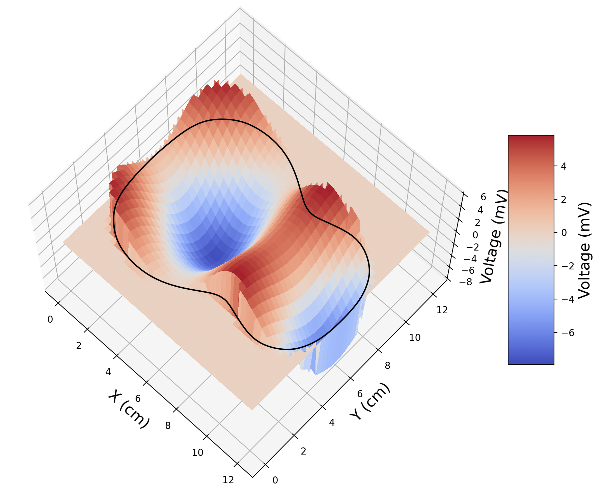
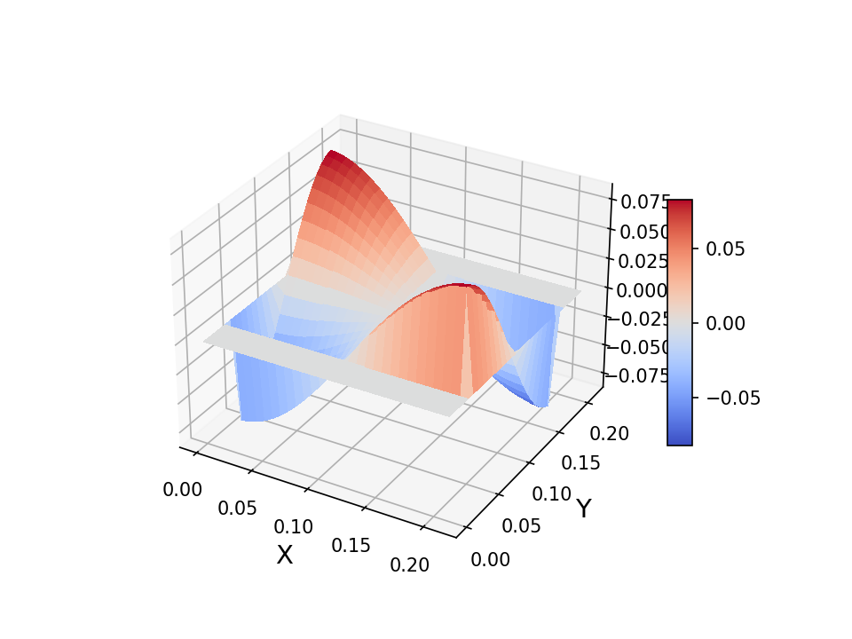
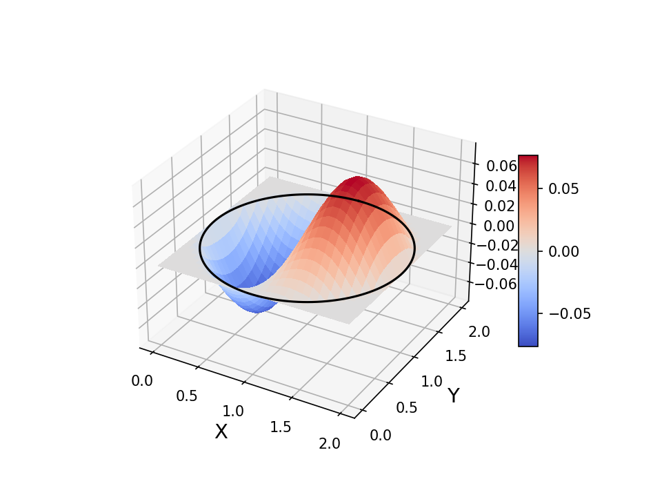
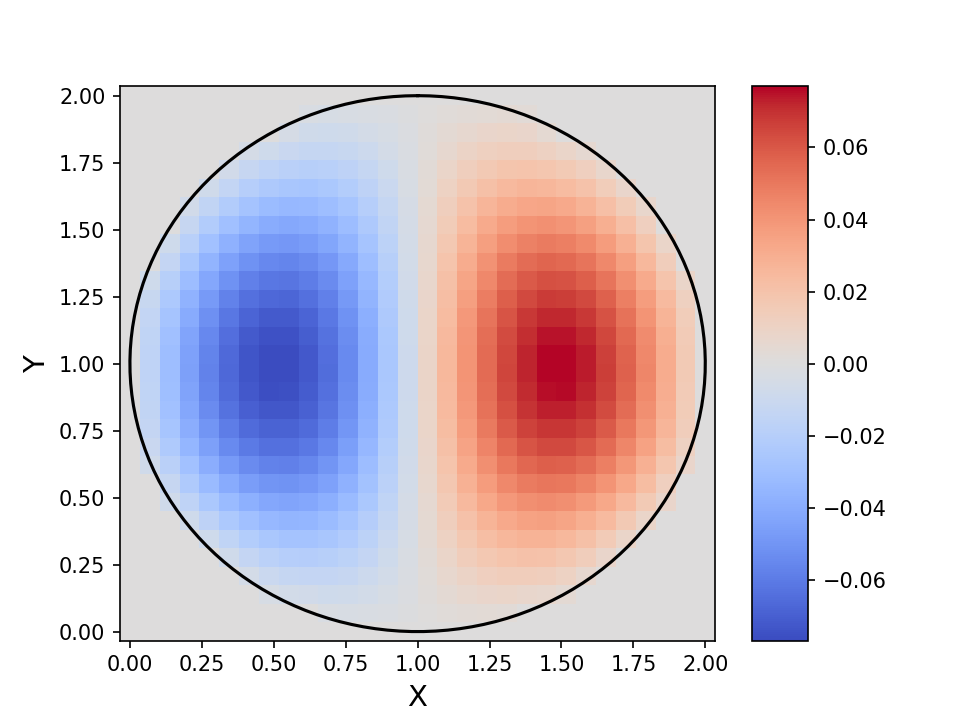

# Resonance Hunter

Solves the 2D standing wave equation on any simple closed contour. Used to find the shape of acoustic waves at resonant frequencies inside custom designed cavities. 

Based on the work by ComputationalScientist [here](https://youtu.be/Le4_LZmkZgs).



## How to Use

### Creating a 2D Domain

#### Rectangle

For a rectangular domain, the input is simple. In `main.py` insert `x = width` and `y = length` and the domain will be a rectangle with the prescribed width and length. Below is an example at `eigmode = 3`.



#### Contours

A 2D domain is created according to the coordinates of a simple closed contour. The coordinates must end at the same place at the beginning. They are stored in under `domain.py`. Below is an explicit example that creates a wacky domain.

```
def wacky():
    # Randomly, strangely fox shaped object
    X = np.array([-3, -2.5, -2, -1, 0, 1, 2, 1.5, 1, 0, -2, -3])
    Y = np.array([0, 1, 4, 3, 4, 1, 0.5, -4, -2, -5, -0.3, 0])
    return X, Y
```

Alternatively we can create a unit circle. 

```
def circle():
    # A unit circle
    Theta = np.linspace(0, 2 * np.pi, 100)
    X = np.sin(Theta)
    Y = np.cos(Theta)
    return X, Y
```

The coordinates can reach to any value, positive or negative. However, the entire domain will be moved to the first Cartesian quadrant such that all values are positive. The original shape is retained. 

Feel free to add your own coordinates! Do not forget to format them in a function. Remember to call your `X` and `Y` back in `main.py`.


### Running the Program

After choosing your contour in `main.py`, you can choose your preferences, including the wave speed, resolution, and degree of splines in the interpolation. The wave speed can be arbitrary, and `main.py` includes the speed of sound in dry air.

You can select a boundary condition, either `"dirichlet"` or `"neumann"`, a particular eigenmode, and the output format. Each eigenmode returns a different solution, and their lower limit is 0. Their upper limit depends on the resolution. Usually, the higher the eigenmode, the greater the number of nodes and antinodes. For a 3D projection, you can input `"3D"`. Anything else will output a heatmap. So in the code below, we are looking for the second eigenmode, or `eigmode = 1` of a standing wave with Dirichlet boundary conditions. The space between points will be smoothed with cubic spline, and our resolution will be 30x30. The final graph will be in 3D.

```
WaveEquationResonsanceHunter(
x, y, 
v(temperature), 
N=30, 
spline_degree=3 
).play(
        bc="dirichlet",
        eigmode=1,
        draw_format="3D"
        )
```

 In this example we will continue with the unit circle. The code will first return a heatmap showing the grid on which the equation will run on.


Then a graph will be shown with the chosen resonance.  The eigenvalue and wave frequency will be returned as well. Since we selected a 3D plot, we will see the graph below.



If instead we wrote `draw_format="heatmap"`, this will come out.



> **Happy Hunting!**